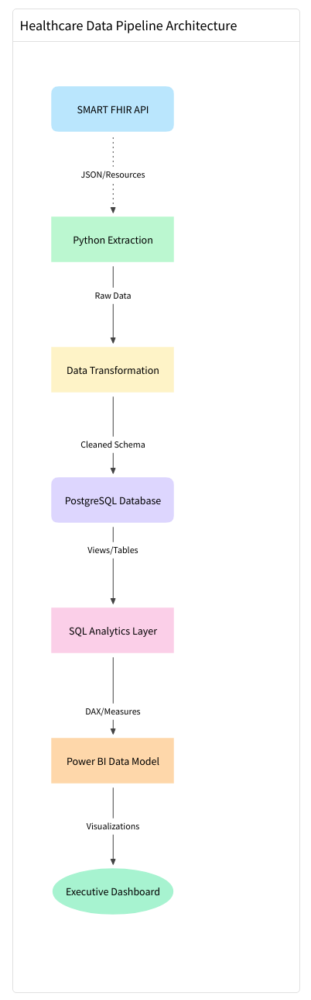
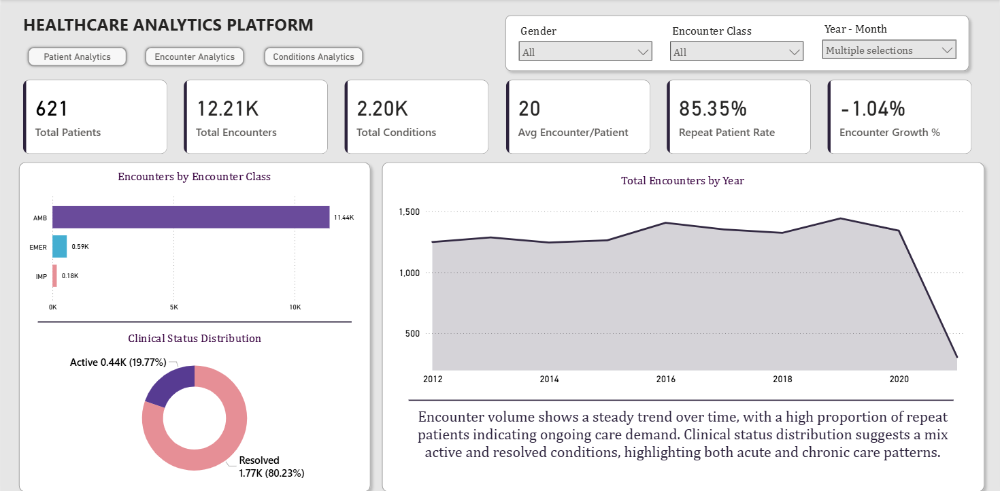
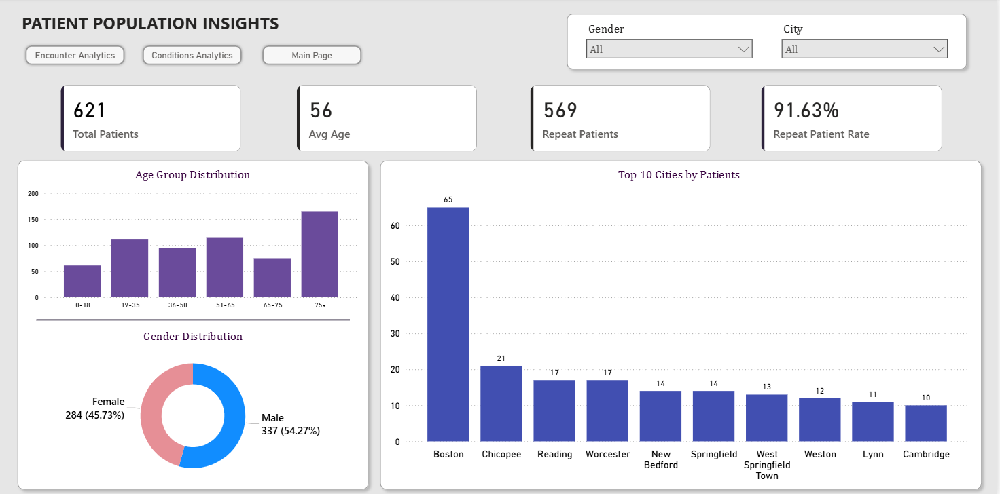
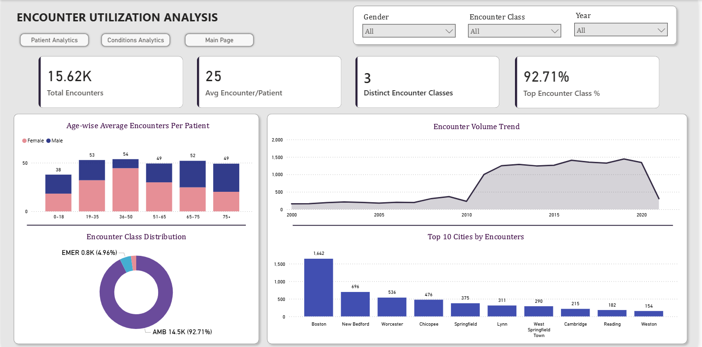
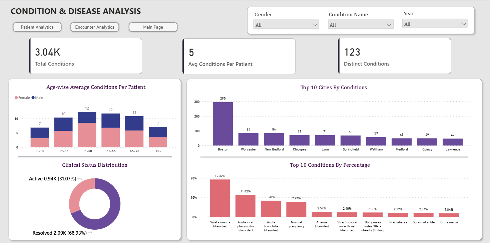
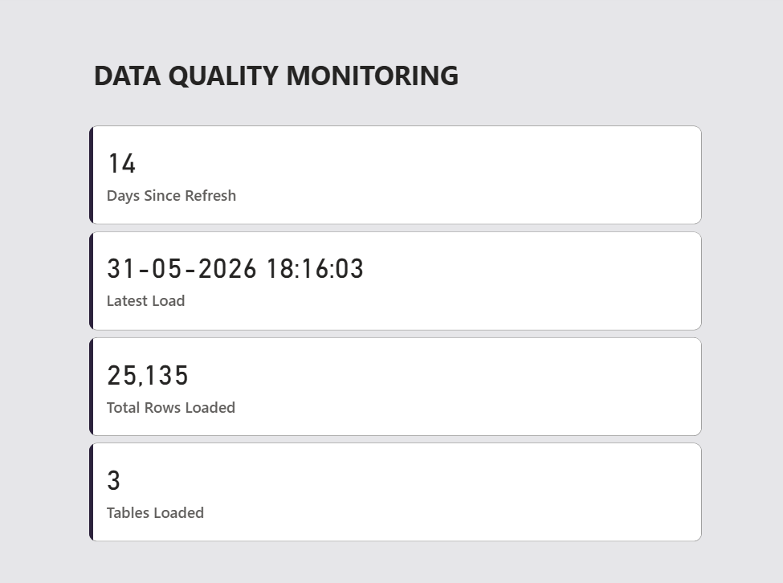
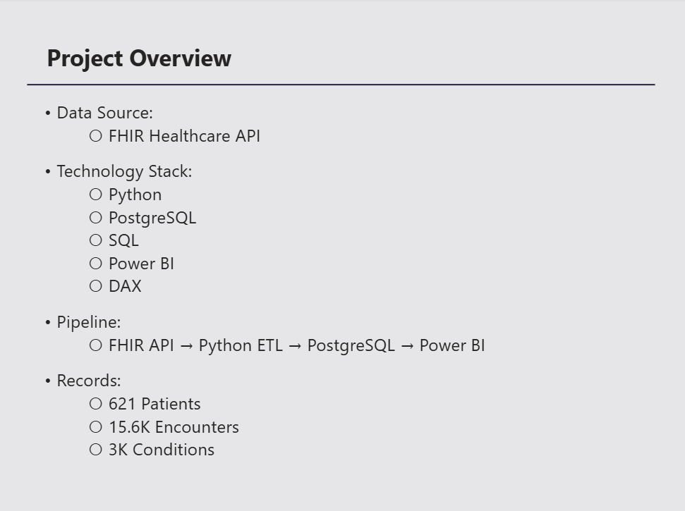

# Healthcare Analytics Platform

## Project Overview

This project demonstrates the development of an end-to-end Healthcare Analytics Platform using FHIR healthcare data. The solution automates data extraction, transformation, storage, and visualization to provide actionable insights into patient demographics, healthcare encounters, and disease prevalence.

The project simulates a real-world analytics workflow by integrating API-based healthcare data ingestion, PostgreSQL data warehousing, SQL transformations, and Power BI reporting.

---

## Business Problem

Healthcare organizations generate large volumes of patient and clinical data. Decision-makers require a centralized analytics platform to monitor patient populations, healthcare utilization, and condition trends.

This project addresses that need by building a scalable analytics pipeline capable of transforming raw FHIR healthcare data into business-ready dashboards.

---

## Technology Stack

### Data Extraction

* Python
* Requests Library
* SMART on FHIR API

### Data Storage

* PostgreSQL
* pgAdmin

### Data Processing

* Pandas
* SQL
* ETL Pipeline

### Business Intelligence

* Power BI
* Power Query
* DAX

---

## Architecture Diagram

---

## Data Pipeline Architecture

FHIR API

↓

Python Extraction Layer

↓

Data Cleaning & Transformation

↓

PostgreSQL Data Warehouse

↓

SQL Aggregation Layer

↓

Power BI Semantic Model

↓

Executive Dashboard

---

## Data Model

The dashboard follows a star schema design:

### Dimension Tables

* Patient

### Fact Tables

* Encounter
* Condition

### Supporting Tables

* ETL Log
* Patient Summary
* Repeat Patients
* Top Conditions

---

## Key Features

### Automated ETL Pipeline

* Extracts healthcare data from SMART on FHIR API
* Cleans and standardizes raw JSON data
* Loads processed datasets into PostgreSQL
* Supports one-click execution through pipeline automation

### SQL Analytics Layer

* Patient summary aggregations
* Repeat patient analysis
* Top condition identification
* ETL monitoring and audit logging

### Executive Dashboard

* Patient population monitoring
* Encounter utilization analysis
* Disease prevalence tracking
* Geographic healthcare insights
* Data quality monitoring

---

## Dashboard Pages

### Executive Overview

Provides a high-level summary of healthcare operations including patient volume, encounter trends, condition distribution, and key performance indicators.

### Patient Population Insights

Analyzes patient demographics, age distribution, repeat patient behavior, and geographic distribution.

### Encounter Utilization Analysis

Tracks encounter trends, utilization patterns, and encounter class distribution.

### Condition & Disease Analysis

Explores disease prevalence, condition distribution, clinical status breakdown, and geographic disease burden.

### Data Quality Monitoring

Monitors ETL execution, data freshness, records loaded, and pipeline health.

### Project Overview

---

## Key Insights Generated

* Patient population distribution across age groups and cities
* Repeat patient identification and utilization patterns
* Most prevalent healthcare conditions
* Encounter volume trends over time
* Clinical condition status monitoring
* Data quality and ETL performance tracking

---

## Repository Structure

healthcare-api-project/

├── dashboard/

├── screenshots/

├── sql/

├── src/

├── requirements.txt

└── README.md

---

## Future Enhancements

* Incremental ETL processing
* Streamlit deployment
* Automated scheduling using Airflow
* Cloud deployment on AWS/Azure
* Advanced healthcare KPI tracking
* Real-time dashboard refresh

---

## Author

Rutuja Kadam

M.Sc. Statistics | Data Analyst

Skills: SQL, Power BI, Python, PostgreSQL, ETL, Data Modeling, DAX, Statistical Analysis
